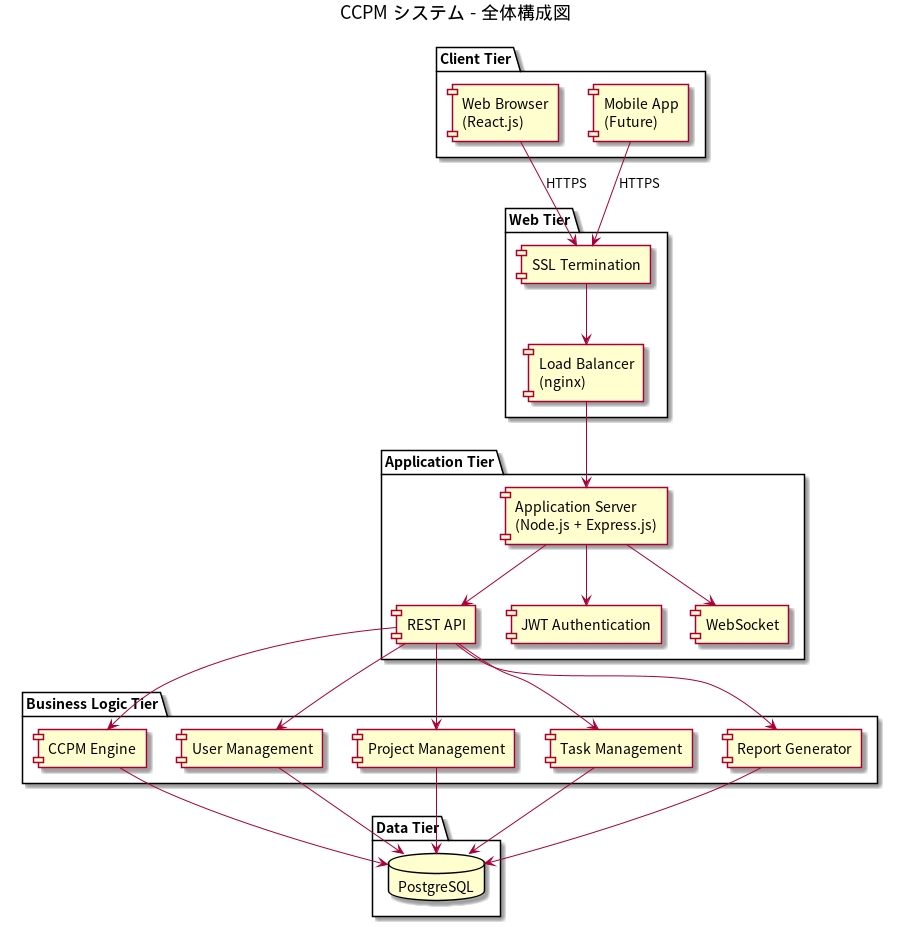
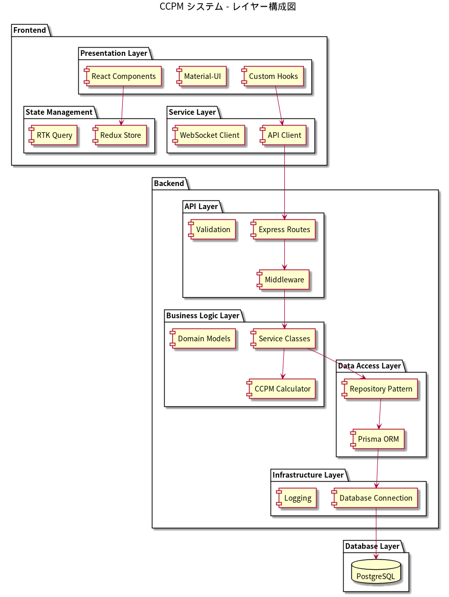
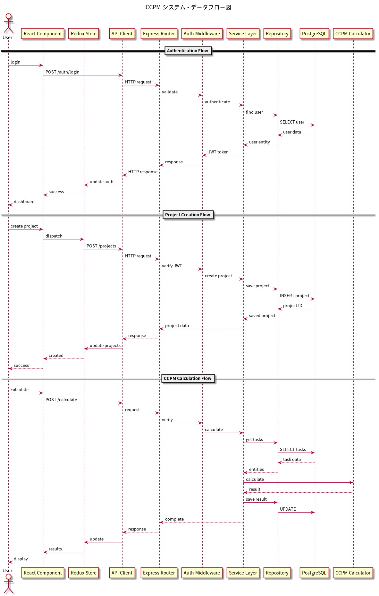

# アーキテクチャ設計書 - CCPM システム

## 1. 技術スタック

### 1.1 バックエンド
- **言語**: TypeScript (Node.js)
- **フレームワーク**: Express.js
- **理由**: 
  - TypeScriptによる型安全性の確保
  - Node.jsの豊富なエコシステム
  - Express.jsの軽量性と拡張性

### 1.2 フロントエンド
- **言語**: TypeScript
- **フレームワーク**: React.js
- **UI ライブラリ**: Material-UI (MUI)
- **状態管理**: Redux Toolkit
- **理由**:
  - Reactの豊富なコミュニティとライブラリ
  - Material-UIによる一貫性のあるUI/UX
  - Redux Toolkitによる予測可能な状態管理

### 1.3 データベース
- **RDBMS**: PostgreSQL
- **ORM**: Prisma
- **理由**:
  - PostgreSQLの信頼性と高性能
  - Prismaの型安全なデータアクセス
  - 複雑なリレーションの効率的な管理

### 1.4 認証・セキュリティ
- **認証**: JWT (JSON Web Token)
- **暗号化**: bcrypt (パスワード)
- **HTTPS**: Let's Encrypt (本番環境)
- **理由**:
  - JWTのステートレス認証
  - bcryptの強力なハッシュ化
  - 無料SSL証明書の活用

### 1.5 開発・運用
- **バージョン管理**: Git (GitHub)
- **CI/CD**: GitHub Actions
- **コンテナ**: Docker
- **テスト**: Jest, React Testing Library
- **静的解析**: ESLint, Prettier
- **理由**:
  - GitHubエコシステムの活用
  - Dockerによる環境統一
  - 包括的なテスト環境

## 2. システム構成

### 2.1 全体構成図

**PlantUMLファイル**: `doc/uml/architecture_system.puml`

### 2.2 レイヤー構成

**PlantUMLファイル**: `doc/uml/architecture_layers.puml`

## 3. コンポーネント設計

### 3.1 バックエンドコンポーネント

#### 3.1.1 認証コンポーネント (Auth)
- **責務**: ユーザー認証・認可
- **機能**: ログイン、ログアウト、JWT検証
- **依存関係**: User Service, JWT Library

#### 3.1.2 ユーザー管理コンポーネント (User Service)
- **責務**: ユーザーのCRUD操作
- **機能**: 登録、プロフィール管理、ロール管理
- **依存関係**: Database Layer

#### 3.1.3 プロジェクト管理コンポーネント (Project Service)
- **責務**: プロジェクトのCRUD操作
- **機能**: 作成、編集、削除、メンバー管理
- **依存関係**: Database Layer, User Service

#### 3.1.4 タスク管理コンポーネント (Task Service)
- **責務**: タスクのCRUD操作と依存関係管理
- **機能**: タスク作成、依存関係設定、進捗更新
- **依存関係**: Database Layer, Project Service

#### 3.1.5 CCPM分析コンポーネント (CCMP Engine)
- **責務**: クリティカルチェーン分析とバッファ計算
- **機能**: チェーン識別、バッファ配置、進捗分析
- **依存関係**: Task Service

#### 3.1.6 レポートコンポーネント (Report Service)
- **責務**: 各種レポート生成
- **機能**: PDF生成、グラフ作成、データエクスポート
- **依存関係**: CCPM Engine, Task Service

### 3.2 フロントエンドコンポーネント

#### 3.2.1 認証コンポーネント
- **LoginForm**: ログイン画面
- **RegisterForm**: 登録画面
- **AuthGuard**: 認証状態チェック

#### 3.2.2 ダッシュボードコンポーネント
- **Dashboard**: メイン画面
- **ProjectOverview**: プロジェクト概要
- **TaskSummary**: タスク一覧

#### 3.2.3 プロジェクト管理コンポーネント
- **ProjectList**: プロジェクト一覧
- **ProjectForm**: プロジェクト作成・編集
- **ProjectDetail**: プロジェクト詳細

#### 3.2.4 タスク管理コンポーネント
- **TaskList**: タスク一覧
- **TaskForm**: タスク作成・編集
- **TaskBoard**: かんばんボード
- **GanttChart**: ガントチャート

#### 3.2.5 分析・レポートコンポーネント
- **CriticalChainView**: クリティカルチェーン表示
- **BufferChart**: バッファ消費チャート
- **FeverChart**: フィーバーチャート
- **ReportGenerator**: レポート生成

## 4. データフロー

**PlantUMLファイル**: `doc/uml/architecture_dataflow.puml`

### 4.1 主要データフロー
- **認証フロー**: ユーザーログインからJWT発行まで
- **プロジェクト作成フロー**: プロジェクト作成からデータベース保存まで
- **CCPM計算フロー**: タスクデータからクリティカルチェーン計算結果まで

## 5. セキュリティ設計

### 5.1 認証・認可
- **JWT**を使用したステートレス認証
- **RBAC**(Role-Based Access Control)によるアクセス制御
- **リフレッシュトークン**による長期認証

### 5.2 データ保護
- **パスワードハッシュ化** (bcrypt, rounds=12)
- **SQL インジェクション対策** (Prisma ORM)
- **XSS 対策** (入力サニタイズ)
- **CSRF 対策** (CSRFトークン)

### 5.3 通信セキュリティ
- **HTTPS強制** (本番環境)
- **CORS設定** (適切なオリジン制限)
- **レート制限** (DDoS対策)

## 6. パフォーマンス設計

### 6.1 データベース最適化
- **インデックス設計** (頻繁に検索されるカラム)
- **クエリ最適化** (N+1問題の回避)
- **接続プール** (コネクション数の最適化)

### 6.2 フロントエンド最適化
- **コード分割** (React.lazy)
- **メモ化** (React.memo, useMemo)
- **画像最適化** (WebP, 遅延読み込み)

### 6.3 キャッシュ戦略
- **ブラウザキャッシュ** (静的リソース)
- **API レスポンスキャッシュ** (Redis, 将来的)

## 7. スケーラビリティ

### 7.1 水平スケーリング準備
- **ステートレス設計** (JWT認証)
- **データベース接続プール**
- **ロードバランサー対応**

### 7.2 将来の拡張性
- **マイクロサービス化** (必要に応じて分割可能)
- **API ゲートウェイ** (将来的な導入)
- **Message Queue** (非同期処理、将来的)

## 8. 監視・ログ

### 8.1 ログ設計
- **構造化ログ** (JSON形式)
- **ログレベル** (ERROR, WARN, INFO, DEBUG)
- **セキュリティログ** (認証失敗、不正アクセス)

### 8.2 監視項目
- **システムメトリクス** (CPU, メモリ, ディスク)
- **アプリケーションメトリクス** (レスポンス時間、エラー率)
- **ビジネスメトリクス** (ユーザー数、プロジェクト数)

## 9. 多言語化設計

### 9.1 国際化 (i18n)
- **React-i18next**を使用
- **言語ファイル** (JSON形式)
- **動的言語切り替え**

### 9.2 対応言語
- **日本語** (デフォルト)
- **英語**
- **将来的な拡張** (中国語、韓国語等)

## 10. 外部システム連携

### 10.1 REST API設計
- **RESTful** な設計原則
- **OpenAPI 3.0** による仕様書
- **バージョニング** (v1, v2...)

### 10.2 連携方式
- **CSV/Excel インポート・エクスポート**
- **iCal形式** (カレンダー連携)
- **Webhook** (通知連携)

## 更新履歴

| 日付 | 版数 | 更新内容 | 更新者 |
|------|------|----------|--------|
| 2025-01-22 | 1.0 | 初版作成 | - |