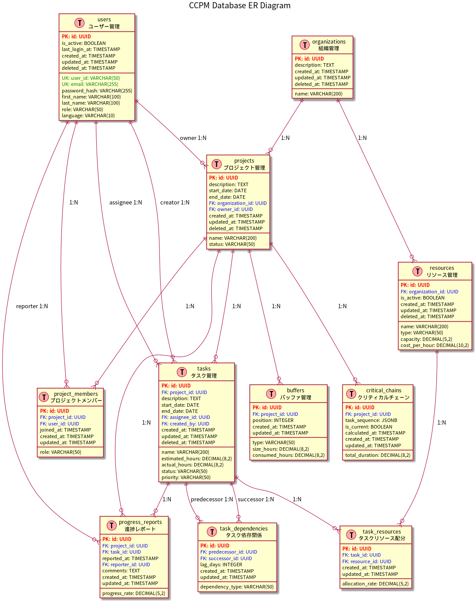
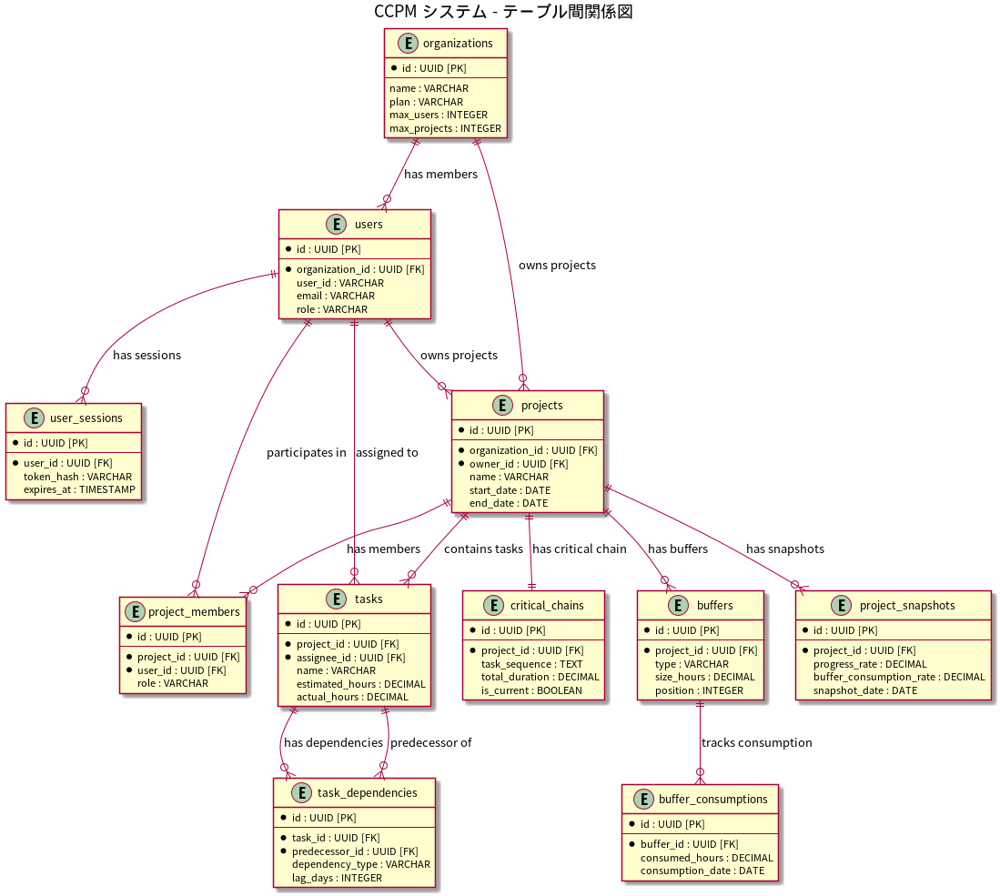
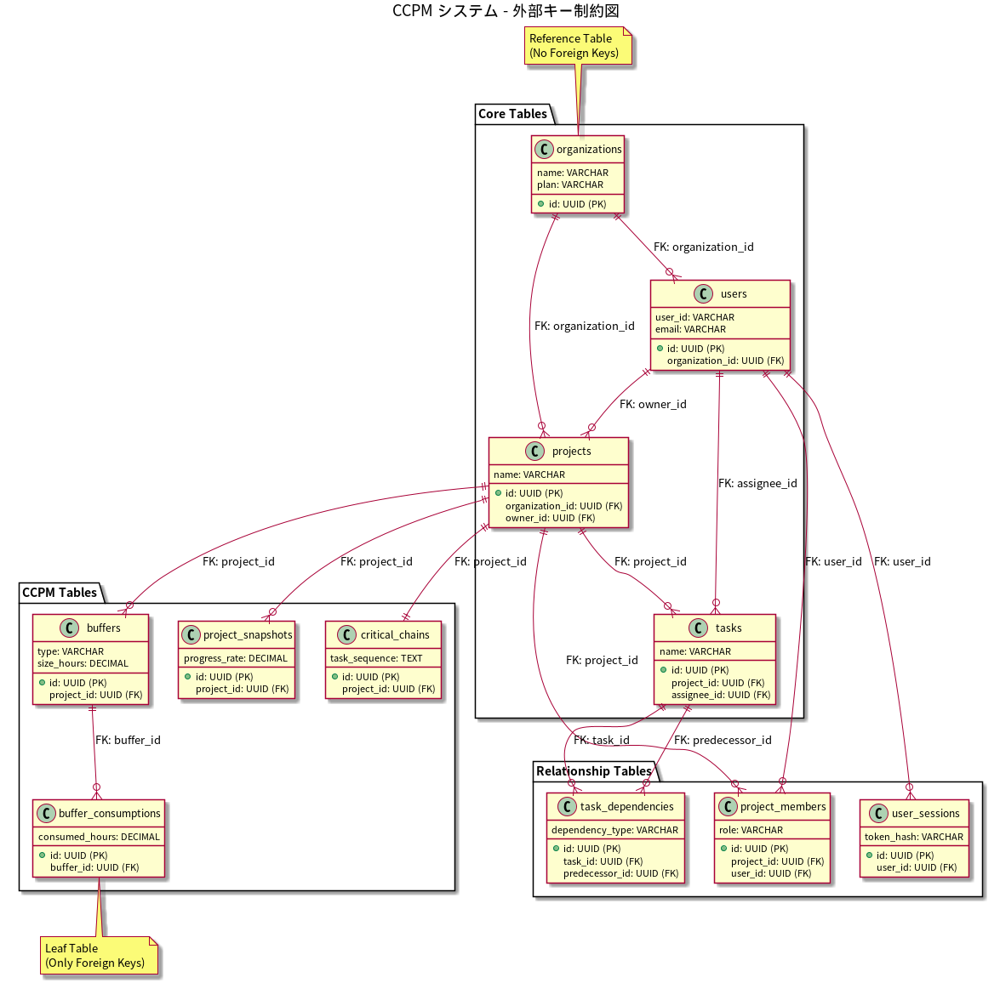

# データベース設計書 - CCPM システム

## 1. データベース概要

### 1.1 データベース仕様
- **DBMS**: PostgreSQL 15+
- **文字エンコーディング**: UTF-8
- **タイムゾーン**: UTC
- **接続プール**: Prisma Connection Pool

### 1.2 設計方針
- **正規化**: 第3正規形まで適用
- **命名規則**: snake_case
- **主キー**: UUID v4 使用
- **作成・更新日時**: 全テーブルに付与
- **論理削除**: deleted_at カラムによるソフトデリート

## 2. ER図
**PlantUMLファイル**: `doc/uml/database_er.puml`



### 2.1 テーブル構造概要

CCPMシステムは以下の11のテーブルで構成されています：

#### 基本エンティティ
- **users**: ユーザー情報管理
- **organizations**: 組織情報管理
- **projects**: プロジェクト情報管理
- **tasks**: タスク情報管理

#### 関係エンティティ  
- **task_dependencies**: タスク間の依存関係
- **project_members**: プロジェクトメンバー管理
- **user_sessions**: ユーザーセッション管理

#### CCPM専用エンティティ
- **critical_chains**: クリティカルチェーン情報
- **buffers**: バッファ情報管理
- **buffer_consumptions**: バッファ消費履歴
- **project_snapshots**: プロジェクト進捗スナップショット

#### テーブル間関係

**PlantUMLファイル**: `doc/uml/database_relationships.puml`



#### テーブル詳細サマリー

| テーブル名 | 主要目的 | カラム数 | 主な用途 |
|------------|----------|----------|----------|
| users | ユーザー管理 | 12 | 認証、プロフィール管理 |
| organizations | 組織管理 | 9 | マルチテナント、プラン管理 |
| projects | プロジェクト管理 | 11 | プロジェクト基本情報 |
| tasks | タスク管理 | 15 | 作業単位、進捗管理 |
| task_dependencies | 依存関係 | 6 | タスク間の制約定義 |
| project_members | メンバー管理 | 6 | アクセス権限、役割 |
| user_sessions | セッション管理 | 8 | JWT認証、セキュリティ |
| critical_chains | クリティカルチェーン | 8 | CCPM分析結果 |
| buffers | バッファ管理 | 9 | バッファ定義、配置 |
| buffer_consumptions | バッファ消費 | 7 | 進捗監視、履歴 |
| project_snapshots | 進捗スナップショット | 9 | 履歴管理、トレンド分析 |

#### データ容量見積もり

**小規模運用（100ユーザー、1000プロジェクト）:**
- users: ~10KB
- projects: ~500KB  
- tasks: ~5MB
- 合計: ~10MB

**中規模運用（1000ユーザー、10000プロジェクト）:**
- users: ~100KB
- projects: ~5MB
- tasks: ~50MB
- 合計: ~100MB

**大規模運用（10000ユーザー、100000プロジェクト）:**
- users: ~1MB
- projects: ~50MB
- tasks: ~500MB
- 合計: ~1GB

#### 正規化レベル

**第1正規形（1NF）**: 全テーブルが原子的な値のみを格納
- 重複するグループの排除
- 各セルに単一の値

**第2正規形（2NF）**: 部分関数従属の排除
- 主キーに完全関数従属
- task_dependencies テーブルで依存関係を分離

**第3正規形（3NF）**: 推移関数従属の排除
- 非キー属性間の依存関係排除
- organizations, users, projects の階層分離

#### 参照整合性制約

**外部キー制約**: 

**PlantUMLファイル**: `doc/uml/database_foreign_keys.puml`



**チェック制約**:
- projects.start_date < projects.end_date
- tasks.start_date < tasks.end_date  
- tasks.estimated_hours > 0
- buffers.size_hours >= 0
- buffer_consumptions.consumed_hours >= 0

## 3. テーブル設計詳細

### 3.1 users (ユーザー)
CCPMシステムを利用するユーザーの情報を管理

| カラム名 | データ型 | NULL | デフォルト | 説明 |
|----------|----------|------|------------|------|
| id | UUID | NOT NULL | gen_random_uuid() | 主キー |
| user_id | VARCHAR(50) | NOT NULL | - | ユーザーID（ログインID） |
| email | VARCHAR(255) | NOT NULL | - | メールアドレス（通知用） |
| password_hash | VARCHAR(255) | NOT NULL | - | ハッシュ化されたパスワード |
| first_name | VARCHAR(100) | NOT NULL | - | 名 |
| last_name | VARCHAR(100) | NOT NULL | - | 姓 |
| role | VARCHAR(50) | NOT NULL | 'USER' | ロール (ADMIN, MANAGER, USER) |
| language | VARCHAR(10) | NOT NULL | 'ja' | 使用言語 (ja, en) |
| is_active | BOOLEAN | NOT NULL | true | アカウント有効状態 |
| last_login_at | TIMESTAMP | NULL | - | 最終ログイン日時 |
| created_at | TIMESTAMP | NOT NULL | CURRENT_TIMESTAMP | 作成日時 |
| updated_at | TIMESTAMP | NOT NULL | CURRENT_TIMESTAMP | 更新日時 |
| deleted_at | TIMESTAMP | NULL | - | 削除日時（論理削除） |

**インデックス:**
- PRIMARY KEY (id)
- UNIQUE INDEX (user_id) WHERE deleted_at IS NULL
- UNIQUE INDEX (email) WHERE deleted_at IS NULL
- INDEX (role)
- INDEX (is_active)

### 3.2 organizations (組織)
複数のプロジェクトをまとめる組織の情報

| カラム名 | データ型 | NULL | デフォルト | 説明 |
|----------|----------|------|------------|------|
| id | UUID | NOT NULL | gen_random_uuid() | 主キー |
| name | VARCHAR(200) | NOT NULL | - | 組織名 |
| description | TEXT | NULL | - | 組織説明 |
| created_at | TIMESTAMP | NOT NULL | CURRENT_TIMESTAMP | 作成日時 |
| updated_at | TIMESTAMP | NOT NULL | CURRENT_TIMESTAMP | 更新日時 |
| deleted_at | TIMESTAMP | NULL | - | 削除日時 |

**インデックス:**
- PRIMARY KEY (id)
- INDEX (name)

### 3.3 projects (プロジェクト)
CCPMで管理するプロジェクトの基本情報

| カラム名 | データ型 | NULL | デフォルト | 説明 |
|----------|----------|------|------------|------|
| id | UUID | NOT NULL | gen_random_uuid() | 主キー |
| name | VARCHAR(200) | NOT NULL | - | プロジェクト名 |
| description | TEXT | NULL | - | プロジェクト説明 |
| start_date | DATE | NOT NULL | - | プロジェクト開始日 |
| end_date | DATE | NULL | - | プロジェクト終了予定日 |
| status | VARCHAR(50) | NOT NULL | 'PLANNING' | ステータス |
| organization_id | UUID | NULL | - | 所属組織ID |
| owner_id | UUID | NOT NULL | - | プロジェクトオーナーID |
| created_at | TIMESTAMP | NOT NULL | CURRENT_TIMESTAMP | 作成日時 |
| updated_at | TIMESTAMP | NOT NULL | CURRENT_TIMESTAMP | 更新日時 |
| deleted_at | TIMESTAMP | NULL | - | 削除日時 |

**インデックス:**
- PRIMARY KEY (id)
- INDEX (organization_id)
- INDEX (owner_id)
- INDEX (status)
- INDEX (start_date, end_date)

### 3.4 project_members (プロジェクトメンバー)
プロジェクトとユーザーの多対多関係

| カラム名 | データ型 | NULL | デフォルト | 説明 |
|----------|----------|------|------------|------|
| id | UUID | NOT NULL | gen_random_uuid() | 主キー |
| project_id | UUID | NOT NULL | - | プロジェクトID |
| user_id | UUID | NOT NULL | - | ユーザーID |
| role | VARCHAR(50) | NOT NULL | 'MEMBER' | プロジェクト内ロール |
| joined_at | TIMESTAMP | NOT NULL | CURRENT_TIMESTAMP | 参加日時 |
| created_at | TIMESTAMP | NOT NULL | CURRENT_TIMESTAMP | 作成日時 |
| updated_at | TIMESTAMP | NOT NULL | CURRENT_TIMESTAMP | 更新日時 |

**インデックス:**
- PRIMARY KEY (id)
- UNIQUE INDEX (project_id, user_id)
- INDEX (user_id)

### 3.5 tasks (タスク)
プロジェクト内のタスク情報

| カラム名 | データ型 | NULL | デフォルト | 説明 |
|----------|----------|------|------------|------|
| id | UUID | NOT NULL | gen_random_uuid() | 主キー |
| project_id | UUID | NOT NULL | - | 所属プロジェクトID |
| name | VARCHAR(200) | NOT NULL | - | タスク名 |
| description | TEXT | NULL | - | タスク説明 |
| estimated_hours | DECIMAL(8,2) | NOT NULL | - | 見積もり時間 |
| actual_hours | DECIMAL(8,2) | NOT NULL | 0 | 実績時間 |
| start_date | DATE | NULL | - | 開始日 |
| end_date | DATE | NULL | - | 終了日 |
| status | VARCHAR(50) | NOT NULL | 'TODO' | ステータス |
| priority | VARCHAR(50) | NOT NULL | 'MEDIUM' | 優先度 |
| assignee_id | UUID | NULL | - | 担当者ID |
| created_by | UUID | NOT NULL | - | 作成者ID |
| created_at | TIMESTAMP | NOT NULL | CURRENT_TIMESTAMP | 作成日時 |
| updated_at | TIMESTAMP | NOT NULL | CURRENT_TIMESTAMP | 更新日時 |
| deleted_at | TIMESTAMP | NULL | - | 削除日時 |

**インデックス:**
- PRIMARY KEY (id)
- INDEX (project_id)
- INDEX (assignee_id)
- INDEX (status)
- INDEX (start_date, end_date)

### 3.6 task_dependencies (タスク依存関係)
タスク間の依存関係を管理

| カラム名 | データ型 | NULL | デフォルト | 説明 |
|----------|----------|------|------------|------|
| id | UUID | NOT NULL | gen_random_uuid() | 主キー |
| predecessor_id | UUID | NOT NULL | - | 先行タスクID |
| successor_id | UUID | NOT NULL | - | 後続タスクID |
| dependency_type | VARCHAR(50) | NOT NULL | 'FS' | 依存関係タイプ |
| lag_days | INTEGER | NOT NULL | 0 | ラグ日数 |
| created_at | TIMESTAMP | NOT NULL | CURRENT_TIMESTAMP | 作成日時 |
| updated_at | TIMESTAMP | NOT NULL | CURRENT_TIMESTAMP | 更新日時 |

**インデックス:**
- PRIMARY KEY (id)
- UNIQUE INDEX (predecessor_id, successor_id)
- INDEX (successor_id)

### 3.7 resources (リソース)
人的・物的リソース情報

| カラム名 | データ型 | NULL | デフォルト | 説明 |
|----------|----------|------|------------|------|
| id | UUID | NOT NULL | gen_random_uuid() | 主キー |
| name | VARCHAR(200) | NOT NULL | - | リソース名 |
| type | VARCHAR(50) | NOT NULL | - | リソースタイプ |
| capacity | DECIMAL(5,2) | NOT NULL | 1.0 | 稼働能力 |
| cost_per_hour | DECIMAL(10,2) | NULL | - | 時間単価 |
| organization_id | UUID | NOT NULL | - | 所属組織ID |
| is_active | BOOLEAN | NOT NULL | true | 利用可能状態 |
| created_at | TIMESTAMP | NOT NULL | CURRENT_TIMESTAMP | 作成日時 |
| updated_at | TIMESTAMP | NOT NULL | CURRENT_TIMESTAMP | 更新日時 |
| deleted_at | TIMESTAMP | NULL | - | 削除日時 |

**インデックス:**
- PRIMARY KEY (id)
- INDEX (organization_id)
- INDEX (type)
- INDEX (is_active)

### 3.8 task_resources (タスクリソース配分)
タスクとリソースの配分関係

| カラム名 | データ型 | NULL | デフォルト | 説明 |
|----------|----------|------|------------|------|
| id | UUID | NOT NULL | gen_random_uuid() | 主キー |
| task_id | UUID | NOT NULL | - | タスクID |
| resource_id | UUID | NOT NULL | - | リソースID |
| allocation_rate | DECIMAL(5,2) | NOT NULL | 1.0 | 配分率 |
| created_at | TIMESTAMP | NOT NULL | CURRENT_TIMESTAMP | 作成日時 |
| updated_at | TIMESTAMP | NOT NULL | CURRENT_TIMESTAMP | 更新日時 |

**インデックス:**
- PRIMARY KEY (id)
- UNIQUE INDEX (task_id, resource_id)
- INDEX (resource_id)

### 3.9 buffers (バッファ)
プロジェクトバッファとフィーディングバッファ

| カラム名 | データ型 | NULL | デフォルト | 説明 |
|----------|----------|------|------------|------|
| id | UUID | NOT NULL | gen_random_uuid() | 主キー |
| project_id | UUID | NOT NULL | - | プロジェクトID |
| type | VARCHAR(50) | NOT NULL | - | バッファタイプ |
| size_hours | DECIMAL(8,2) | NOT NULL | - | バッファサイズ（時間） |
| consumed_hours | DECIMAL(8,2) | NOT NULL | 0 | 消費時間 |
| position | INTEGER | NULL | - | 配置位置 |
| created_at | TIMESTAMP | NOT NULL | CURRENT_TIMESTAMP | 作成日時 |
| updated_at | TIMESTAMP | NOT NULL | CURRENT_TIMESTAMP | 更新日時 |

**インデックス:**
- PRIMARY KEY (id)
- INDEX (project_id)
- INDEX (type)

### 3.10 critical_chains (クリティカルチェーン)
計算されたクリティカルチェーン情報

| カラム名 | データ型 | NULL | デフォルト | 説明 |
|----------|----------|------|------------|------|
| id | UUID | NOT NULL | gen_random_uuid() | 主キー |
| project_id | UUID | NOT NULL | - | プロジェクトID |
| task_sequence | JSONB | NOT NULL | - | タスクシーケンス |
| total_duration | DECIMAL(8,2) | NOT NULL | - | 総所要時間 |
| is_current | BOOLEAN | NOT NULL | true | 最新フラグ |
| calculated_at | TIMESTAMP | NOT NULL | CURRENT_TIMESTAMP | 計算日時 |
| created_at | TIMESTAMP | NOT NULL | CURRENT_TIMESTAMP | 作成日時 |
| updated_at | TIMESTAMP | NOT NULL | CURRENT_TIMESTAMP | 更新日時 |

**インデックス:**
- PRIMARY KEY (id)
- INDEX (project_id)
- INDEX (is_current)

### 3.11 progress_reports (進捗レポート)
タスクの進捗報告（フィーバーチャート・バッファトレンドグラフのデータソース）

| カラム名 | データ型 | NULL | デフォルト | 説明 |
|----------|----------|------|------------|------|
| id | UUID | NOT NULL | gen_random_uuid() | 主キー |
| project_id | UUID | NOT NULL | - | プロジェクトID |
| task_id | UUID | NOT NULL | - | タスクID |
| progress_rate | DECIMAL(5,2) | NOT NULL | - | 進捗率（0-100） |
| reported_at | TIMESTAMP | NOT NULL | - | 報告日時 |
| reporter_id | UUID | NOT NULL | - | 報告者ID |
| comments | TEXT | NULL | - | コメント |
| created_at | TIMESTAMP | NOT NULL | CURRENT_TIMESTAMP | 作成日時 |
| updated_at | TIMESTAMP | NOT NULL | CURRENT_TIMESTAMP | 更新日時 |

**インデックス:**
- PRIMARY KEY (id)
- INDEX (project_id)
- INDEX (task_id)
- INDEX (reported_at)

## 4. 制約とリレーション

### 4.1 外部キー制約
```sql
-- Projects
ALTER TABLE projects ADD CONSTRAINT fk_projects_organization 
  FOREIGN KEY (organization_id) REFERENCES organizations(id);
ALTER TABLE projects ADD CONSTRAINT fk_projects_owner 
  FOREIGN KEY (owner_id) REFERENCES users(id);

-- Project Members
ALTER TABLE project_members ADD CONSTRAINT fk_project_members_project 
  FOREIGN KEY (project_id) REFERENCES projects(id) ON DELETE CASCADE;
ALTER TABLE project_members ADD CONSTRAINT fk_project_members_user 
  FOREIGN KEY (user_id) REFERENCES users(id);

-- Tasks
ALTER TABLE tasks ADD CONSTRAINT fk_tasks_project 
  FOREIGN KEY (project_id) REFERENCES projects(id) ON DELETE CASCADE;
ALTER TABLE tasks ADD CONSTRAINT fk_tasks_assignee 
  FOREIGN KEY (assignee_id) REFERENCES users(id);
ALTER TABLE tasks ADD CONSTRAINT fk_tasks_created_by 
  FOREIGN KEY (created_by) REFERENCES users(id);

-- Task Dependencies
ALTER TABLE task_dependencies ADD CONSTRAINT fk_task_dependencies_predecessor 
  FOREIGN KEY (predecessor_id) REFERENCES tasks(id) ON DELETE CASCADE;
ALTER TABLE task_dependencies ADD CONSTRAINT fk_task_dependencies_successor 
  FOREIGN KEY (successor_id) REFERENCES tasks(id) ON DELETE CASCADE;

-- Resources
ALTER TABLE resources ADD CONSTRAINT fk_resources_organization 
  FOREIGN KEY (organization_id) REFERENCES organizations(id);

-- Task Resources
ALTER TABLE task_resources ADD CONSTRAINT fk_task_resources_task 
  FOREIGN KEY (task_id) REFERENCES tasks(id) ON DELETE CASCADE;
ALTER TABLE task_resources ADD CONSTRAINT fk_task_resources_resource 
  FOREIGN KEY (resource_id) REFERENCES resources(id);

-- Buffers
ALTER TABLE buffers ADD CONSTRAINT fk_buffers_project 
  FOREIGN KEY (project_id) REFERENCES projects(id) ON DELETE CASCADE;

-- Critical Chains
ALTER TABLE critical_chains ADD CONSTRAINT fk_critical_chains_project 
  FOREIGN KEY (project_id) REFERENCES projects(id) ON DELETE CASCADE;

-- Progress Reports
ALTER TABLE progress_reports ADD CONSTRAINT fk_progress_reports_project 
  FOREIGN KEY (project_id) REFERENCES projects(id) ON DELETE CASCADE;
ALTER TABLE progress_reports ADD CONSTRAINT fk_progress_reports_task 
  FOREIGN KEY (task_id) REFERENCES tasks(id) ON DELETE CASCADE;
ALTER TABLE progress_reports ADD CONSTRAINT fk_progress_reports_reporter 
  FOREIGN KEY (reporter_id) REFERENCES users(id);
```

### 4.2 チェック制約
```sql
-- Progress rate validation
ALTER TABLE progress_reports ADD CONSTRAINT ck_progress_rate 
  CHECK (progress_rate >= 0 AND progress_rate <= 100);

-- Allocation rate validation
ALTER TABLE task_resources ADD CONSTRAINT ck_allocation_rate 
  CHECK (allocation_rate > 0 AND allocation_rate <= 1);

-- Resource capacity validation
ALTER TABLE resources ADD CONSTRAINT ck_capacity 
  CHECK (capacity > 0);

-- Task hours validation
ALTER TABLE tasks ADD CONSTRAINT ck_estimated_hours 
  CHECK (estimated_hours > 0);
ALTER TABLE tasks ADD CONSTRAINT ck_actual_hours 
  CHECK (actual_hours >= 0);

-- Buffer hours validation
ALTER TABLE buffers ADD CONSTRAINT ck_buffer_hours 
  CHECK (size_hours > 0 AND consumed_hours >= 0 AND consumed_hours <= size_hours);
```

## 5. Prismaスキーマ設計

### 5.1 主要なモデル定義
```prisma
model User {
  id            String    @id @default(uuid()) @db.Uuid
  userId        String    @unique @map("user_id") @db.VarChar(50)
  email         String    @unique @db.VarChar(255)
  passwordHash  String    @map("password_hash") @db.VarChar(255)
  firstName     String    @map("first_name") @db.VarChar(100)
  lastName      String    @map("last_name") @db.VarChar(100)
  role          UserRole  @default(USER)
  language      String    @default("ja") @db.VarChar(10)
  isActive      Boolean   @default(true) @map("is_active")
  lastLoginAt   DateTime? @map("last_login_at")
  createdAt     DateTime  @default(now()) @map("created_at")
  updatedAt     DateTime  @updatedAt @map("updated_at")
  deletedAt     DateTime? @map("deleted_at")

  // Relations
  ownedProjects    Project[]        @relation("ProjectOwner")
  projectMembers   ProjectMember[]
  assignedTasks    Task[]           @relation("TaskAssignee")
  createdTasks     Task[]           @relation("TaskCreator")
  progressReports  ProgressReport[]

  @@map("users")
}

model Project {
  id             String     @id @default(uuid()) @db.Uuid
  name           String     @db.VarChar(200)
  description    String?
  startDate      DateTime   @map("start_date") @db.Date
  endDate        DateTime?  @map("end_date") @db.Date
  status         ProjectStatus @default(PLANNING)
  organizationId String?    @map("organization_id") @db.Uuid
  ownerId        String     @map("owner_id") @db.Uuid
  createdAt      DateTime   @default(now()) @map("created_at")
  updatedAt      DateTime   @updatedAt @map("updated_at")
  deletedAt      DateTime?  @map("deleted_at")

  // Relations
  organization     Organization?    @relation(fields: [organizationId], references: [id])
  owner           User             @relation("ProjectOwner", fields: [ownerId], references: [id])
  members         ProjectMember[]
  tasks           Task[]
  buffers         Buffer[]
  criticalChains  CriticalChain[]
  progressReports ProgressReport[]

  @@map("projects")
}

model Task {
  id             String      @id @default(uuid()) @db.Uuid
  projectId      String      @map("project_id") @db.Uuid
  name           String      @db.VarChar(200)
  description    String?
  estimatedHours Decimal     @map("estimated_hours") @db.Decimal(8, 2)
  actualHours    Decimal     @default(0) @map("actual_hours") @db.Decimal(8, 2)
  startDate      DateTime?   @map("start_date") @db.Date
  endDate        DateTime?   @map("end_date") @db.Date
  status         TaskStatus  @default(TODO)
  priority       TaskPriority @default(MEDIUM)
  assigneeId     String?     @map("assignee_id") @db.Uuid
  createdBy      String      @map("created_by") @db.Uuid
  createdAt      DateTime    @default(now()) @map("created_at")
  updatedAt      DateTime    @updatedAt @map("updated_at")
  deletedAt      DateTime?   @map("deleted_at")

  // Relations
  project         Project           @relation(fields: [projectId], references: [id], onDelete: Cascade)
  assignee        User?             @relation("TaskAssignee", fields: [assigneeId], references: [id])
  creator         User              @relation("TaskCreator", fields: [createdBy], references: [id])
  predecessors    TaskDependency[]  @relation("TaskSuccessor")
  successors      TaskDependency[]  @relation("TaskPredecessor")
  resources       TaskResource[]
  progressReports ProgressReport[]

  @@map("tasks")
}
```

## 6. パフォーマンス最適化

### 6.1 インデックス設計

CCPMシステムのパフォーマンス最適化のため、以下のインデックス戦略を採用します。

#### 主要インデックス一覧

**users テーブル**
```sql
-- 主キーインデックス（自動）
CREATE UNIQUE INDEX users_pkey ON users (id);

-- ユニークインデックス
CREATE UNIQUE INDEX users_user_id_key ON users (user_id);
CREATE UNIQUE INDEX users_email_key ON users (email);

-- 検索最適化インデックス
CREATE INDEX users_organization_id_idx ON users (organization_id);
CREATE INDEX users_role_idx ON users (role);
CREATE INDEX users_active_idx ON users (is_active) WHERE is_active = true;

-- 複合インデックス
CREATE INDEX users_org_active_idx ON users (organization_id, is_active);
```

**projects テーブル**
```sql
-- 主キーインデックス（自動）
CREATE UNIQUE INDEX projects_pkey ON projects (id);

-- 外部キーインデックス
CREATE INDEX projects_organization_id_idx ON projects (organization_id);
CREATE INDEX projects_owner_id_idx ON projects (owner_id);

-- ステータス・日付検索
CREATE INDEX projects_status_idx ON projects (status);
CREATE INDEX projects_date_range_idx ON projects (start_date, end_date);

-- 複合インデックス（よく使われる検索パターン）
CREATE INDEX projects_org_status_idx ON projects (organization_id, status);
CREATE INDEX projects_owner_status_idx ON projects (owner_id, status);

-- 論理削除対応
CREATE INDEX projects_active_idx ON projects (organization_id, status) 
  WHERE deleted_at IS NULL;
```

**tasks テーブル**
```sql
-- 主キーインデックス（自動）
CREATE UNIQUE INDEX tasks_pkey ON tasks (id);

-- 外部キーインデックス
CREATE INDEX tasks_project_id_idx ON tasks (project_id);
CREATE INDEX tasks_assignee_id_idx ON tasks (assignee_id);

-- ステータス・優先度検索
CREATE INDEX tasks_status_idx ON tasks (status);
CREATE INDEX tasks_priority_idx ON tasks (priority);

-- 日付範囲検索
CREATE INDEX tasks_date_range_idx ON tasks (start_date, end_date);

-- 複合インデックス（プロジェクト内タスク検索）
CREATE INDEX tasks_project_status_idx ON tasks (project_id, status);
CREATE INDEX tasks_project_assignee_idx ON tasks (project_id, assignee_id);
CREATE INDEX tasks_assignee_status_idx ON tasks (assignee_id, status);

-- 進捗監視用
CREATE INDEX tasks_progress_idx ON tasks (project_id, progress_rate);

-- CCPM計算用（クリティカルチェーン判定）
CREATE INDEX tasks_critical_idx ON tasks (project_id, is_on_critical_chain);
```

**task_dependencies テーブル**
```sql
-- 主キーインデックス（自動）
CREATE UNIQUE INDEX task_dependencies_pkey ON task_dependencies (id);

-- 外部キーインデックス
CREATE INDEX task_deps_task_id_idx ON task_dependencies (task_id);
CREATE INDEX task_deps_predecessor_id_idx ON task_dependencies (predecessor_id);

-- 依存関係検索用複合インデックス
CREATE INDEX task_deps_task_pred_idx ON task_dependencies (task_id, predecessor_id);

-- 依存関係タイプ検索
CREATE INDEX task_deps_type_idx ON task_dependencies (dependency_type);

-- 循環参照チェック用（パフォーマンス重視）
CREATE INDEX task_deps_graph_idx ON task_dependencies (predecessor_id, task_id);
```

**project_members テーブル**
```sql
-- 主キーインデックス（自動）
CREATE UNIQUE INDEX project_members_pkey ON project_members (id);

-- 外部キーインデックス
CREATE INDEX project_members_project_id_idx ON project_members (project_id);
CREATE INDEX project_members_user_id_idx ON project_members (user_id);

-- ユニーク制約（重複メンバー防止）
CREATE UNIQUE INDEX project_members_unique ON project_members (project_id, user_id);

-- ロール検索
CREATE INDEX project_members_role_idx ON project_members (role);

-- ユーザーのプロジェクト一覧検索
CREATE INDEX project_members_user_role_idx ON project_members (user_id, role);
```

**buffers テーブル**
```sql
-- 主キーインデックス（自動）
CREATE UNIQUE INDEX buffers_pkey ON buffers (id);

-- 外部キーインデックス
CREATE INDEX buffers_project_id_idx ON buffers (project_id);

-- バッファタイプ検索
CREATE INDEX buffers_type_idx ON buffers (type);

-- プロジェクト内バッファ検索（位置順）
CREATE INDEX buffers_project_position_idx ON buffers (project_id, position);

-- バッファ消費率計算用
CREATE INDEX buffers_project_type_idx ON buffers (project_id, type);
```

**buffer_consumptions テーブル**
```sql
-- 主キーインデックス（自動）
CREATE UNIQUE INDEX buffer_consumptions_pkey ON buffer_consumptions (id);

-- 外部キーインデックス
CREATE INDEX buffer_cons_buffer_id_idx ON buffer_consumptions (buffer_id);

-- 日付範囲検索（履歴分析用）
CREATE INDEX buffer_cons_date_idx ON buffer_consumptions (consumption_date);

-- バッファ別消費履歴検索
CREATE INDEX buffer_cons_buffer_date_idx ON buffer_consumptions (buffer_id, consumption_date);

-- トレンド分析用（最新データ優先）
CREATE INDEX buffer_cons_recent_idx ON buffer_consumptions (buffer_id, consumption_date DESC);
```

**critical_chains テーブル**
```sql
-- 主キーインデックス（自動）
CREATE UNIQUE INDEX critical_chains_pkey ON critical_chains (id);

-- 外部キーインデックス
CREATE INDEX critical_chains_project_id_idx ON critical_chains (project_id);

-- 現在有効なクリティカルチェーン検索
CREATE INDEX critical_chains_current_idx ON critical_chains (project_id, is_current);

-- 計算日時検索（履歴管理）
CREATE INDEX critical_chains_calc_date_idx ON critical_chains (calculated_at);
```

**project_snapshots テーブル**
```sql
-- 主キーインデックス（自動）
CREATE UNIQUE INDEX project_snapshots_pkey ON project_snapshots (id);

-- 外部キーインデックス
CREATE INDEX proj_snapshots_project_id_idx ON project_snapshots (project_id);

-- 日付範囲検索（トレンド分析）
CREATE INDEX proj_snapshots_date_idx ON project_snapshots (snapshot_date);

-- プロジェクト別履歴検索
CREATE INDEX proj_snapshots_proj_date_idx ON project_snapshots (project_id, snapshot_date);

-- 最新スナップショット検索
CREATE INDEX proj_snapshots_latest_idx ON project_snapshots (project_id, snapshot_date DESC);
```

#### インデックス設計原則

**1. 選択性の高いカラムを優先**
- UUID主キー > ユニークカラム > 高選択性カラム > 低選択性カラム

**2. 複合インデックスのカラム順序**
- 等価検索条件 → 範囲検索条件 → ソート条件の順

**3. 部分インデックスの活用**
```sql
-- 論理削除されていないレコードのみ
WHERE deleted_at IS NULL

-- アクティブなレコードのみ
WHERE is_active = true

-- 特定ステータスのみ
WHERE status IN ('ACTIVE', 'IN_PROGRESS')
```

**4. カバリングインデックス**
```sql
-- SELECT文で必要なカラムを全て含める
CREATE INDEX tasks_covering_idx ON tasks (project_id, status) 
  INCLUDE (name, estimated_hours, assignee_id);
```

### 6.2 インデックス運用戦略

**監視すべきメトリクス**
- インデックス使用率（pg_stat_user_indexes）
- スキャン回数とヒット率
- インデックスサイズ（pg_indexes_size）

**メンテナンス方針**
- 定期的なREINDEX実行（月次）
- 未使用インデックスの削除
- カーディナリティの変化監視

**パフォーマンステスト**
- 本番相当データでのクエリ性能測定
- EXPLAIN ANALYZE による実行計画確認
- インデックスヒント（Prismaレベル）の活用

### 6.3 クエリ最適化
- **JOIN の最適化**: 必要な場合のみ結合
- **N+1問題の回避**: Prisma include/select の適切な使用
- **ページネーション**: cursor-based pagination の実装

### 6.4 キャッシュ戦略
- **頻繁にアクセスされるデータ**のキャッシュ
- **計算結果**（クリティカルチェーン等）のキャッシュ
- **Redis**を使用した分散キャッシュ（将来的）

## 更新履歴

| 日付 | 版数 | 更新内容 | 更新者 |
|------|------|----------|--------|
| 2025-01-22 | 1.0 | 初版作成 | - |
| 2025-01-22 | 1.1 | ユーザー認証をEmail→ユーザーID方式に変更 | - |
| 2025-01-22 | 1.2 | PlantUMLによるER図・テーブル設計図追加 | - |