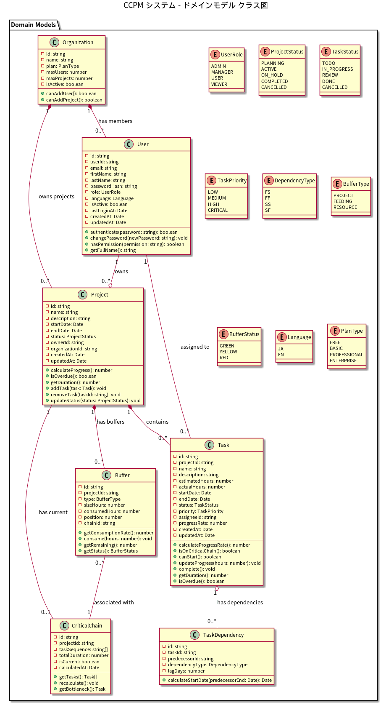
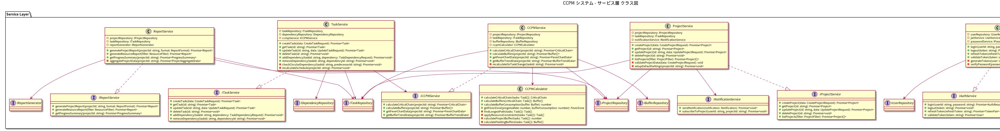
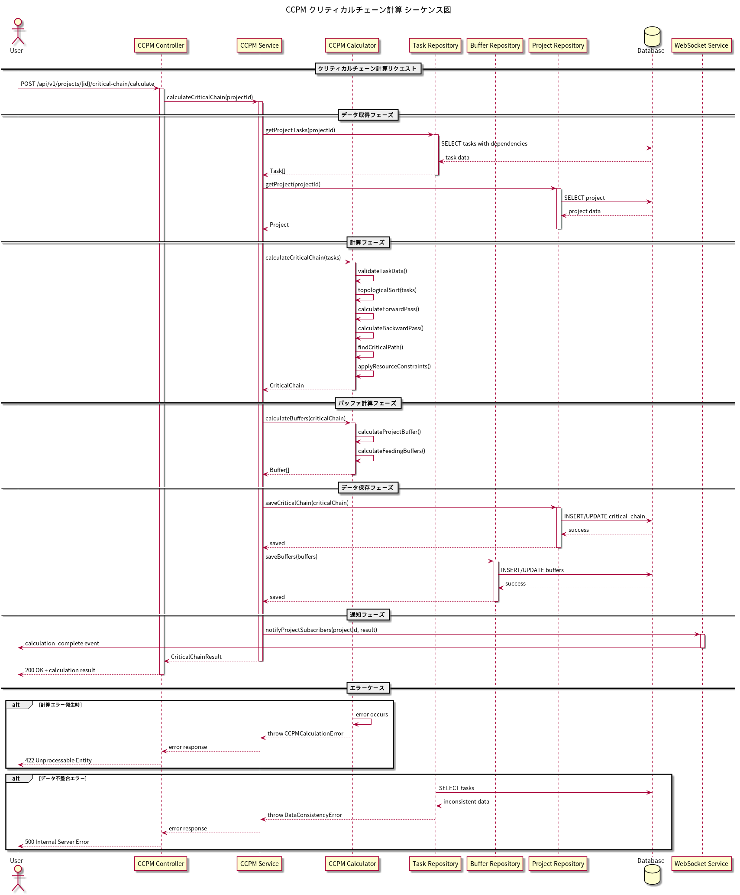
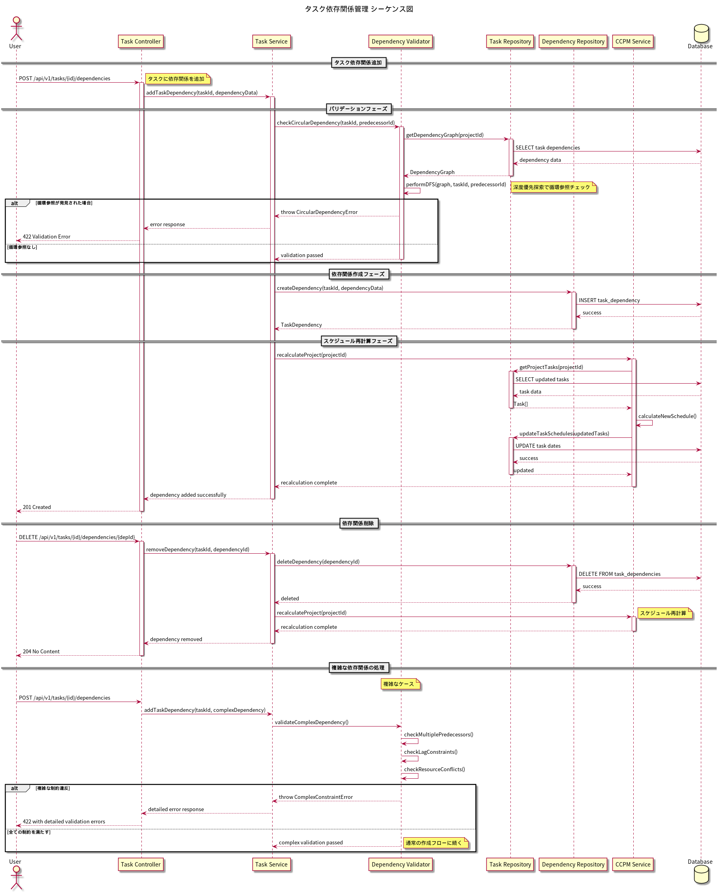

# 詳細設計書 - CCPM システム

## 1. 設計概要

### 1.1 設計方針
- **モジュラー設計**: 機能単位でモジュールを分割
- **SOLID原則**: 拡張性と保守性を重視
- **DDD（Domain Driven Design）**: ビジネスロジックを中心とした設計
- **Clean Architecture**: 依存関係の明確化

### 1.2 アーキテクチャパターン
- **3層アーキテクチャ**:
  - プレゼンテーション層（React）
  - アプリケーション層（Express.js API）
  - データアクセス層（Prisma ORM + PostgreSQL）

## 2. モジュール設計

### 2.1 バックエンドモジュール構成

```
backend/
├── src/
│   ├── api/                    # APIレイヤー
│   │   ├── controllers/        # HTTPリクエストハンドリング
│   │   │   ├── auth.controller.ts
│   │   │   ├── user.controller.ts
│   │   │   ├── project.controller.ts
│   │   │   ├── task.controller.ts
│   │   │   ├── ccpm.controller.ts
│   │   │   └── report.controller.ts
│   │   ├── middleware/         # ミドルウェア
│   │   │   ├── auth.middleware.ts
│   │   │   ├── validation.middleware.ts
│   │   │   ├── error.middleware.ts
│   │   │   └── rateLimit.middleware.ts
│   │   └── routes/            # ルーティング定義
│   │       └── index.ts
│   ├── application/           # アプリケーションレイヤー
│   │   ├── services/          # ビジネスロジック
│   │   │   ├── auth.service.ts
│   │   │   ├── user.service.ts
│   │   │   ├── project.service.ts
│   │   │   ├── task.service.ts
│   │   │   ├── ccpm.service.ts
│   │   │   └── report.service.ts
│   │   └── dto/              # データ転送オブジェクト
│   │       ├── auth.dto.ts
│   │       ├── project.dto.ts
│   │       └── task.dto.ts
│   ├── domain/               # ドメインレイヤー
│   │   ├── models/           # ドメインモデル
│   │   │   ├── user.model.ts
│   │   │   ├── project.model.ts
│   │   │   ├── task.model.ts
│   │   │   ├── buffer.model.ts
│   │   │   └── criticalChain.model.ts
│   │   ├── repositories/     # リポジトリインターフェース
│   │   │   └── interfaces/
│   │   └── valueObjects/     # 値オブジェクト
│   │       ├── taskStatus.ts
│   │       └── projectStatus.ts
│   ├── infrastructure/       # インフラストラクチャレイヤー
│   │   ├── database/         # データベース関連
│   │   │   ├── prisma/
│   │   │   └── repositories/ # リポジトリ実装
│   │   ├── external/         # 外部サービス連携
│   │   └── messaging/        # メッセージング（WebSocket等）
│   ├── shared/              # 共通モジュール
│   │   ├── errors/          # カスタムエラー
│   │   ├── utils/           # ユーティリティ
│   │   └── types/           # 共通型定義
│   └── config/              # 設定
│       ├── database.config.ts
│       ├── auth.config.ts
│       └── app.config.ts
```

### 2.2 フロントエンドモジュール構成

```
frontend/
├── src/
│   ├── components/           # UIコンポーネント
│   │   ├── common/          # 共通コンポーネント
│   │   │   ├── Button/
│   │   │   ├── Card/
│   │   │   ├── Modal/
│   │   │   └── Table/
│   │   ├── layout/          # レイアウトコンポーネント
│   │   │   ├── Header/
│   │   │   ├── Sidebar/
│   │   │   └── Footer/
│   │   ├── auth/            # 認証関連
│   │   │   ├── LoginForm/
│   │   │   └── UserMenu/
│   │   ├── project/         # プロジェクト管理
│   │   │   ├── ProjectList/
│   │   │   ├── ProjectDetail/
│   │   │   └── ProjectForm/
│   │   ├── task/            # タスク管理
│   │   │   ├── TaskList/
│   │   │   ├── TaskBoard/
│   │   │   ├── GanttChart/
│   │   │   └── TaskForm/
│   │   ├── ccpm/            # CCPM分析
│   │   │   ├── FeverChart/
│   │   │   ├── BufferTrend/
│   │   │   └── CriticalChain/
│   │   └── report/          # レポート
│   │       ├── ProjectReport/
│   │       └── ResourceReport/
│   ├── pages/               # ページコンポーネント
│   │   ├── Dashboard/
│   │   ├── Projects/
│   │   ├── Tasks/
│   │   └── Reports/
│   ├── hooks/               # カスタムフック
│   │   ├── useAuth.ts
│   │   ├── useProject.ts
│   │   └── useCCPM.ts
│   ├── services/            # API通信サービス
│   │   ├── api.ts
│   │   ├── authService.ts
│   │   └── projectService.ts
│   ├── store/               # 状態管理（Redux Toolkit）
│   │   ├── slices/
│   │   │   ├── authSlice.ts
│   │   │   ├── projectSlice.ts
│   │   │   └── taskSlice.ts
│   │   └── store.ts
│   ├── utils/               # ユーティリティ
│   │   ├── date.utils.ts
│   │   ├── validation.utils.ts
│   │   └── chart.utils.ts
│   ├── types/               # 型定義
│   │   ├── models.ts
│   │   └── api.types.ts
│   └── styles/              # スタイル
│       ├── theme.ts
│       └── globalStyles.ts
```

### 2.3 モジュール責務

#### 2.3.1 バックエンドモジュール責務

| レイヤー | 責務 | 依存方向 |
|---------|------|----------|
| API | HTTPリクエスト/レスポンス処理 | → Application |
| Application | ビジネスロジック実行、トランザクション管理 | → Domain |
| Domain | ビジネスルール、エンティティ定義 | なし |
| Infrastructure | 技術的実装（DB、外部API等） | → Domain |

#### 2.3.2 フロントエンドモジュール責務

| モジュール | 責務 |
|-----------|------|
| Components | UI表示、ユーザー操作処理 |
| Pages | ページレベルのコンポーネント組み合わせ |
| Hooks | 状態管理、副作用処理のカプセル化 |
| Services | バックエンドAPIとの通信 |
| Store | グローバル状態管理 |

## 3. クラス設計

### 3.1 ドメインモデルクラス図
**PlantUMLファイル**: `doc/uml/class_domain_models.puml`



主要なドメインモデル：
- **User**: ユーザー管理、認証
- **Project**: プロジェクト管理、進捗計算
- **Task**: タスク管理、依存関係
- **CriticalChain**: クリティカルチェーン情報
- **Buffer**: バッファ管理、消費監視
- **Organization**: 組織管理

### 3.2 サービス層クラス図
**PlantUMLファイル**: `doc/uml/class_services.puml`



主要なサービス：
- **AuthService**: 認証・認可処理
- **ProjectService**: プロジェクト管理ビジネスロジック
- **TaskService**: タスク管理・依存関係処理
- **CCPMService**: CCPM分析・計算
- **ReportService**: レポート生成

## 4. シーケンス設計

### 4.1 CCPM計算フロー
**PlantUMLファイル**: `doc/uml/sequence_ccpm_calculation.puml`



クリティカルチェーン計算の詳細フロー：
1. データ取得（プロジェクト・タスク情報）
2. CCPM計算実行（クリティカルパス特定、バッファ計算）
3. 結果保存
4. WebSocket通知

### 4.2 タスク依存関係管理
**PlantUMLファイル**: `doc/uml/sequence_task_dependency.puml`



依存関係追加・削除のフロー：
1. 循環参照チェック
2. 依存関係作成/削除
3. スケジュール再計算
4. 変更通知

## 5. ビジネスロジック設計

### 5.1 プロジェクト管理機能

#### 5.1.1 Project クラス
```typescript
class Project {
  private id: string;
  private name: string;
  private description: string;
  private startDate: Date;
  private endDate: Date;
  private status: ProjectStatus;
  private ownerId: string;
  private organizationId: string;
  private tasks: Task[] = [];
  private buffers: Buffer[] = [];

  constructor(data: ProjectData) {
    this.validateProjectData(data);
    // プロパティ初期化
  }
  
  public calculateProgress(): number {
    if (this.tasks.length === 0) return 0;
    
    const totalEstimated = this.tasks.reduce((sum, task) => sum + task.estimatedHours, 0);
    const totalActual = this.tasks.reduce((sum, task) => sum + task.actualHours, 0);
    
    return Math.min((totalActual / totalEstimated) * 100, 100);
  }
  
  public isOverdue(): boolean {
    return this.status === ProjectStatus.ACTIVE && new Date() > this.endDate;
  }
  
  public addTask(task: Task): void {
    this.validateTaskForProject(task);
    this.tasks.push(task);
  }
  
  private validateTaskForProject(task: Task): void {
    if (task.startDate < this.startDate || task.endDate > this.endDate) {
      throw new BusinessLogicError('タスクの期間がプロジェクト期間を超えています', 'TASK_DATE_OUT_OF_RANGE');
    }
  }
}
```

#### 5.1.2 ProjectService
```typescript
class ProjectService implements IProjectService {
  constructor(
    private projectRepository: IProjectRepository,
    private taskRepository: ITaskRepository,
    private notificationService: INotificationService
  ) {}

  async createProject(projectData: CreateProjectRequest): Promise<Project> {
    // 1. データバリデーション
    this.validateProjectData(projectData);
    
    // 2. プロジェクト作成
    const project = new Project(projectData);
    
    // 3. データベース保存
    const savedProject = await this.projectRepository.save(project);
    
    // 4. 初期設定
    await this.setupDefaultSettings(savedProject.id);
    
    // 5. 通知送信
    await this.notificationService.notifyProjectCreated(savedProject);
    
    return savedProject;
  }
  
  private validateProjectData(data: CreateProjectRequest): void {
    if (data.startDate >= data.endDate) {
      throw new ValidationError('開始日は終了日より前である必要があります', []);
    }
    
    if (data.name.trim().length === 0) {
      throw new ValidationError('プロジェクト名は必須です', []);
    }
  }
  
  private async setupDefaultSettings(projectId: string): Promise<void> {
    // デフォルトバッファ設定
    const defaultBuffer = new Buffer({
      projectId,
      type: BufferType.PROJECT,
      sizeHours: 0, // 後でCCPM計算で算出
      position: 1
    });
    
    await this.bufferRepository.save(defaultBuffer);
  }
}
```

### 5.2 CCPM分析機能

#### 5.2.1 CCPMCalculator
```typescript
class CCPMCalculator {
  public calculateCriticalChain(tasks: Task[]): CriticalChain {
    // 1. 入力データバリデーション
    this.validateTaskData(tasks);
    
    // 2. トポロジカルソート
    const sortedTasks = this.topologicalSort(tasks);
    
    // 3. フォワードパス計算
    const forwardPass = this.calculateForwardPass(sortedTasks);
    
    // 4. バックワードパス計算
    const backwardPass = this.calculateBackwardPass(sortedTasks, forwardPass);
    
    // 5. クリティカルパス特定
    const criticalPath = this.findCriticalPath(tasks, forwardPass, backwardPass);
    
    // 6. リソース制約適用
    const criticalChain = this.applyResourceConstraints(criticalPath);
    
    return new CriticalChain({
      taskSequence: criticalChain.map(task => task.id),
      totalDuration: this.calculateTotalDuration(criticalChain),
      calculatedAt: new Date()
    });
  }
  
  private calculateForwardPass(tasks: Task[]): Map<string, TaskSchedule> {
    const schedule = new Map<string, TaskSchedule>();
    
    for (const task of tasks) {
      const dependencies = task.getDependencies();
      let earliestStart = task.getStartDate();
      
      // 先行タスクの完了時刻を考慮
      for (const dep of dependencies) {
        const predSchedule = schedule.get(dep.predecessorId);
        if (predSchedule) {
          const predFinish = this.addLag(predSchedule.earlyFinish, dep.lagDays);
          earliestStart = this.maxDate(earliestStart, predFinish);
        }
      }
      
      const earlyFinish = this.addHours(earliestStart, task.getEstimatedHours());
      schedule.set(task.id, {
        earlyStart: earliestStart,
        earlyFinish: earlyFinish
      });
    }
    
    return schedule;
  }
  
  private calculateProjectBuffer(criticalChain: Task[]): number {
    // Root Sum of Squares法
    const variances = criticalChain.map(task => {
      const safetyMargin = task.estimatedHours * 0.5; // 50%安全余裕
      return Math.pow(safetyMargin, 2);
    });
    
    const totalVariance = variances.reduce((sum, variance) => sum + variance, 0);
    return Math.sqrt(totalVariance);
  }
}
```

#### 5.2.2 Buffer管理
```typescript
class Buffer {
  private id: string;
  private projectId: string;
  private type: BufferType;
  private sizeHours: number;
  private consumedHours: number = 0;
  
  public getConsumptionRate(): number {
    if (this.sizeHours === 0) return 0;
    return (this.consumedHours / this.sizeHours) * 100;
  }
  
  public consume(hours: number): void {
    this.consumedHours = Math.min(this.consumedHours + hours, this.sizeHours);
  }
  
  public getStatus(): BufferStatus {
    const consumptionRate = this.getConsumptionRate();
    
    if (consumptionRate < 33) return BufferStatus.GREEN;
    if (consumptionRate < 67) return BufferStatus.YELLOW;
    return BufferStatus.RED;
  }
  
  public getRemaining(): number {
    return Math.max(0, this.sizeHours - this.consumedHours);
  }
}
```

### 5.3 タスク管理機能

#### 5.3.1 TaskService
```typescript
class TaskService implements ITaskService {
  constructor(
    private taskRepository: ITaskRepository,
    private dependencyRepository: IDependencyRepository,
    private ccmpService: ICCPMService
  ) {}

  async addTaskDependency(
    taskId: string, 
    dependencyData: TaskDependencyRequest
  ): Promise<void> {
    // 1. 循環参照チェック
    await this.checkCircularDependency(taskId, dependencyData.predecessorId);
    
    // 2. 依存関係作成
    const dependency = new TaskDependency(dependencyData);
    await this.dependencyRepository.save(dependency);
    
    // 3. スケジュール再計算
    const task = await this.taskRepository.findById(taskId);
    await this.recalculateSchedule(task.projectId);
  }
  
  private async checkCircularDependency(
    taskId: string, 
    predecessorId: string
  ): Promise<void> {
    const visited = new Set<string>();
    const recursionStack = new Set<string>();
    
    if (await this.hasCycleUtil(predecessorId, taskId, visited, recursionStack)) {
      throw new BusinessLogicError(
        '循環参照が発生するため、この依存関係は追加できません',
        'CIRCULAR_DEPENDENCY'
      );
    }
  }
  
  private async hasCycleUtil(
    currentId: string,
    targetId: string,
    visited: Set<string>,
    recursionStack: Set<string>
  ): Promise<boolean> {
    visited.add(currentId);
    recursionStack.add(currentId);
    
    const dependencies = await this.dependencyRepository.findByTaskId(currentId);
    
    for (const dep of dependencies) {
      if (dep.predecessorId === targetId) {
        return true; // 循環参照発見
      }
      
      if (!visited.has(dep.predecessorId)) {
        if (await this.hasCycleUtil(dep.predecessorId, targetId, visited, recursionStack)) {
          return true;
        }
      } else if (recursionStack.has(dep.predecessorId)) {
        return true;
      }
    }
    
    recursionStack.delete(currentId);
    return false;
  }
}
```

### 5.4 レポート機能

#### 5.4.1 FeverChartGenerator
```typescript
class FeverChartGenerator {
  public generateFeverChart(project: Project): FeverChartData {
    const progressRate = project.calculateProgress();
    const bufferConsumption = this.calculateBufferConsumption(project);
    
    // ゾーン判定
    const zone = this.determineZone(progressRate, bufferConsumption);
    
    // 履歴データ取得
    const history = this.getProgressHistory(project.id);
    
    return {
      currentStatus: {
        progressRate,
        bufferConsumption,
        zone,
        riskLevel: this.assessRisk(zone)
      },
      trendData: history,
      recommendations: this.generateRecommendations(zone)
    };
  }
  
  private determineZone(progress: number, consumption: number): FeverZone {
    // 対角線ベースのゾーン分割
    const threshold1 = progress * 0.8; // Green zone
    const threshold2 = progress * 1.2; // Red zone
    
    if (consumption <= threshold1) {
      return FeverZone.GREEN;
    } else if (consumption <= threshold2) {
      return FeverZone.YELLOW;
    } else {
      return FeverZone.RED;
    }
  }
  
  private generateRecommendations(zone: FeverZone): string[] {
    switch (zone) {
      case FeverZone.GREEN:
        return ['順調に進行しています', '現在のペースを維持してください'];
      case FeverZone.YELLOW:
        return [
          'バッファ消費が進んでいます',
          'タスクの優先順位を見直してください',
          'リソースの再配分を検討してください'
        ];
      case FeverZone.RED:
        return [
          '緊急の対応が必要です',
          'プロジェクトマネージャーへ報告してください',
          'スコープの削減を検討してください',
          '追加リソースの確保が必要です'
        ];
    }
  }
}

## 更新履歴

| 日付 | 版数 | 更新内容 | 更新者 |
|------|------|----------|--------|
| 2025-01-22 | 1.0 | 初版作成（モジュール設計） | - |
| 2025-01-22 | 2.0 | 詳細設計完了（クラス図、ビジネスロジック完成） | - |