# 画面設計書 - CCPM システム

## 1. 設計概要

### 1.1 設計方針
- **レスポンシブデザイン**: デスクトップ・タブレット・モバイル対応
- **直感的操作**: ユーザーが迷わない明確なUI
- **アクセシビリティ**: WCAG 2.1 AA レベル準拠
- **一貫性**: 統一されたデザインシステム

### 1.2 使用コンポーネント
- **UIライブラリ**: Material-UI (MUI) v5
- **アイコン**: Material Icons
- **カラーパレット**: Materialデザインカラー
- **フォント**: Noto Sans JP (日本語) / Roboto (英語)

## 2. サイトマップ

```
CCPM システム
├── 認証
│   ├── ログイン画面
│   ├── 登録画面
│   └── パスワードリセット画面
├── ダッシュボード
│   ├── 概要ダッシュボード
│   ├── プロジェクト一覧
│   └── 通知・アラート
├── プロジェクト管理
│   ├── プロジェクト一覧
│   ├── プロジェクト詳細
│   ├── プロジェクト作成・編集
│   └── プロジェクトメンバー管理
├── タスク管理
│   ├── タスク一覧
│   ├── タスク詳細
│   ├── タスク作成・編集
│   ├── ガントチャート
│   ├── かんばんボード
│   └── カレンダービュー
├── CCPM分析
│   ├── クリティカルチェーン表示
│   ├── バッファ管理
│   ├── フィーバーチャート
│   └── バッファトレンドグラフ
├── レポート
│   ├── プロジェクト状況レポート
│   ├── リソース使用状況レポート
│   ├── 進捗レポート
│   └── レポート設定
├── マスター管理
│   ├── ユーザー管理
│   ├── 組織管理
│   ├── リソース管理
│   └── システム設定
└── 設定・ヘルプ
    ├── 個人設定
    ├── 言語設定
    ├── ヘルプ・ドキュメント
    └── お問い合わせ
```

## 3. 画面レイアウト

### 3.1 基本レイアウト構成
**PlantUMLファイル**: `doc/uml/basic_layout.puml`

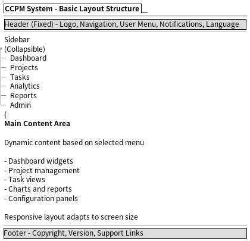

### 3.2 ヘッダー設計
- **ロゴ**: 左上に配置
- **ナビゲーション**: 主要機能へのリンク
- **ユーザーメニュー**: 右上（プロフィール、設定、ログアウト）
- **通知**: ベルアイコンで通知表示
- **言語切替**: 日本語/英語切替ボタン

### 3.3 サイドバー設計
- **折りたたみ可能**: アイコン+テキスト ⇔ アイコンのみ
- **階層構造**: 親メニュー・子メニューの表示
- **現在位置表示**: アクティブなメニューの強調
- **お気に入り**: よく使う機能のショートカット

## 4. 主要画面設計

> **Note**: 各画面の詳細なレイアウトは、PlantUMLファイルでも定義されています。  
> PlantUMLファイル: `doc/uml/` ディレクトリ参照

### 4.1 ログイン画面
**PlantUMLファイル**: `doc/uml/login_screen.puml`

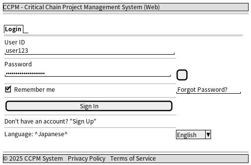

**要素:**
- 中央配置のログインフォーム
- Material-UI Card コンポーネント使用
- ユーザーID・パスワードフィールド
- Remember me チェックボックス
- パスワード表示/非表示切替
- 言語選択ドロップダウン

### 4.2 ダッシュボード画面
**PlantUMLファイル**: `doc/uml/dashboard.puml`

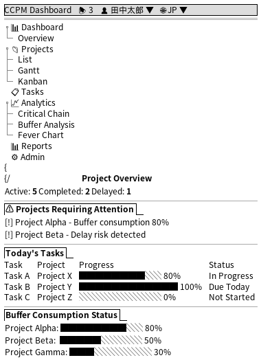

**要素:**
- サマリーカード（アクティブ・完了・遅延プロジェクト数）
- 注意が必要なプロジェクト一覧
- 今日のタスク一覧
- バッファ消費状況（プログレスバー）

### 4.3 プロジェクト一覧画面
**PlantUMLファイル**: `doc/uml/project_list.puml`

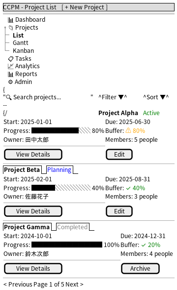


**要素:**
- 新規作成ボタン（右上）
- 検索・フィルタ機能
- プロジェクトカード（名前、期間、進捗、メンバー情報）
- ステータスバッジ
- ページネーション

### 4.4 ガントチャート画面
**PlantUMLファイル**: `doc/uml/gantt_chart.puml`

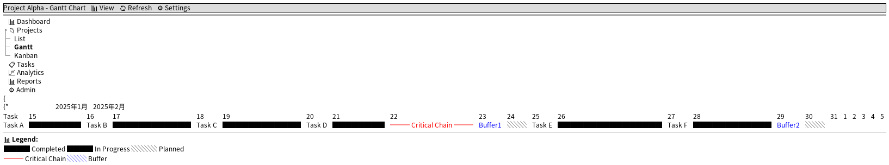


**要素:**
- 時間軸（週・月表示）
- タスクバー（進捗に応じた色分け）
- クリティカルチェーンの強調表示
- バッファの可視化
- 凡例表示

### 4.5 フィーバーチャート画面
**PlantUMLファイル**: `doc/uml/fever_chart.puml`

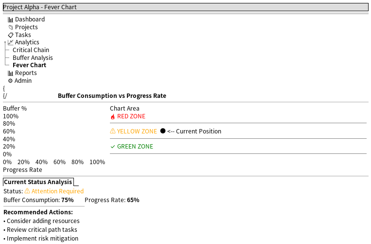


**要素:**
- X軸：進捗率、Y軸：バッファ消費率
- 色分けゾーン（Green, Yellow, Red）
- 現在のプロジェクト位置をプロット
- 状況判定と推奨アクションの表示

### 4.6 バッファトレンドグラフ画面
**PlantUMLファイル**: `doc/uml/buffer_trend.puml`

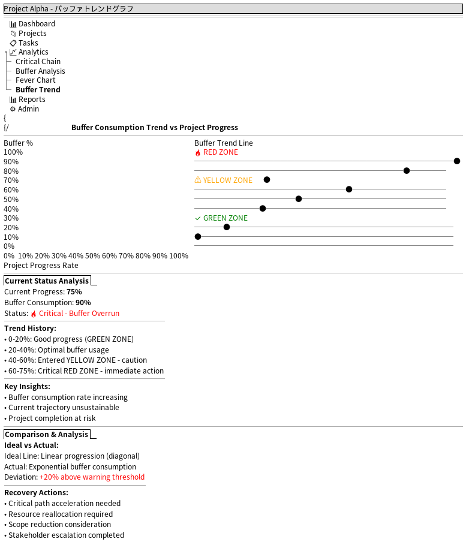

**要素:**
- X軸：プロジェクト進捗率、Y軸：バッファ消費率
- 色分けゾーン（Green, Yellow, Red）
- プロジェクト進行に伴うバッファ消費の軌跡をプロット
- 理想線（対角線）との比較
- 現在位置とトレンド分析

### 4.7 タスク一覧画面
**PlantUMLファイル**: `doc/uml/task_list.puml`

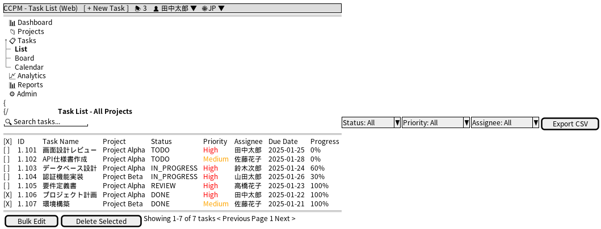

**要素:**
- テーブル形式のタスク一覧
- フィルタ・検索機能
- 一括選択・編集機能
- CSVエクスポート機能

### 4.8 タスクボード画面（かんばん）
**PlantUMLファイル**: `doc/uml/task_board.puml`

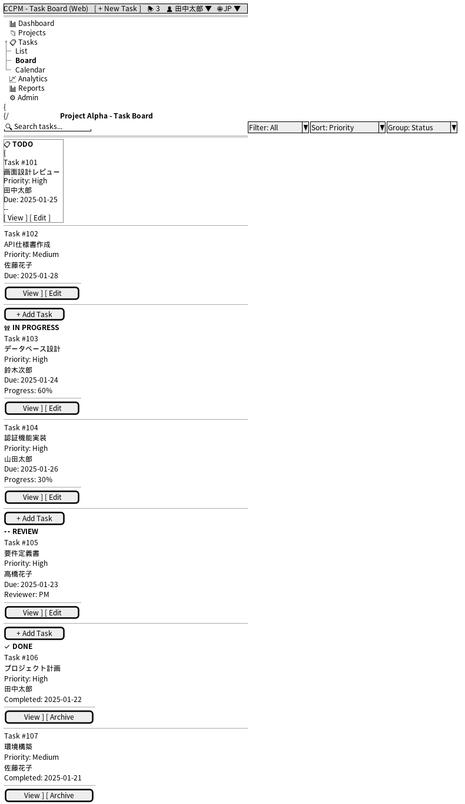

**要素:**
- かんばんボード形式（TODO/IN PROGRESS/REVIEW/DONE）
- ドラッグ&ドロップ対応
- タスクカード表示
- ステータス別グループ化

### 4.9 プロジェクト詳細画面
**PlantUMLファイル**: `doc/uml/project_detail.puml`

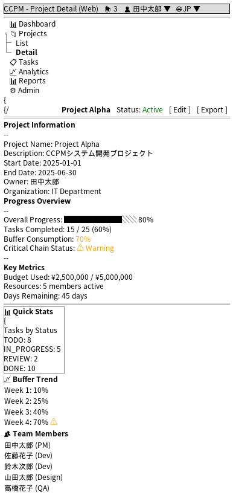

**要素:**
- プロジェクト基本情報
- 進捗サマリー
- チームメンバー一覧
- 最近のアクティビティ

### 4.10 ユーザー管理画面
**PlantUMLファイル**: `doc/uml/user_management.puml`

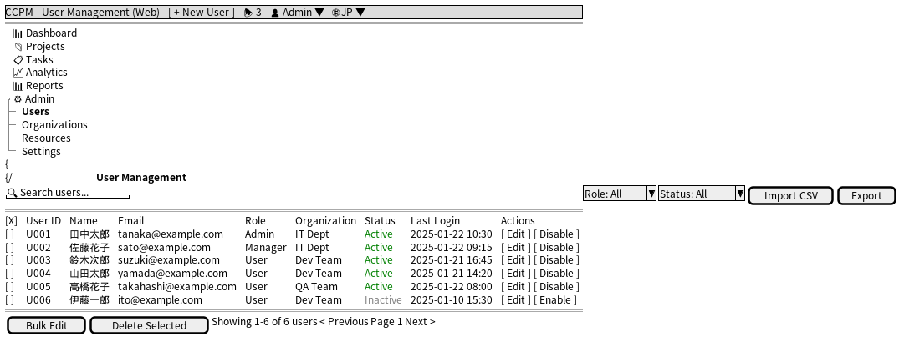

**要素:**
- ユーザー一覧テーブル
- ロール・権限管理
- アクティブ/非アクティブ状態管理
- 一括インポート・エクスポート

### 4.11 設定画面
**PlantUMLファイル**: `doc/uml/settings.puml`

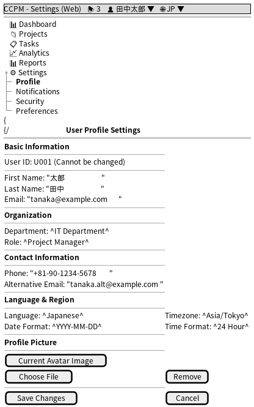

**要素:**
- プロフィール設定
- 通知設定
- セキュリティ設定
- 言語・地域設定

## 5. レスポンシブデザイン

### 5.1 ブレークポイント
- **Mobile**: < 768px
- **Tablet**: 768px - 1024px
- **Desktop**: > 1024px

### 5.2 Mobile First設計
**モバイルレイアウト PlantUMLファイル**: `doc/uml/mobile_layout.puml`

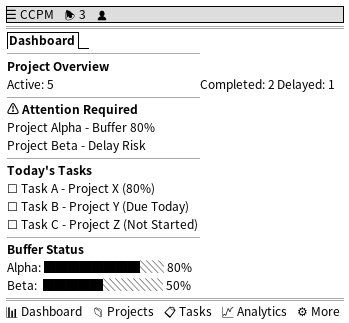

## 6. カラーパレット

### 6.1 Primary Colors
- **Primary**: #1976d2 (Blue 700)
- **Primary Light**: #42a5f5 (Blue 400)
- **Primary Dark**: #1565c0 (Blue 800)

### 6.2 Secondary Colors
- **Secondary**: #dc004e (Pink A400)
- **Secondary Light**: #f48fb1 (Pink 200)
- **Secondary Dark**: #ad1457 (Pink 800)

### 6.3 Status Colors
- **Success**: #4caf50 (Green 500)
- **Warning**: #ff9800 (Orange 500)
- **Error**: #f44336 (Red 500)
- **Info**: #2196f3 (Blue 500)

### 6.4 Text Colors
- **Primary Text**: #212121 (Grey 900)
- **Secondary Text**: #757575 (Grey 600)
- **Disabled Text**: #bdbdbd (Grey 400)

## 7. タイポグラフィ

### 7.1 フォントサイズ階層
- **H1**: 2.125rem (34px) - ページタイトル
- **H2**: 1.5rem (24px) - セクションタイトル
- **H3**: 1.25rem (20px) - サブセクション
- **Body1**: 1rem (16px) - 本文
- **Body2**: 0.875rem (14px) - 補助テキスト
- **Caption**: 0.75rem (12px) - キャプション

### 7.2 行間・余白
- **行間**: 1.5 (150%)
- **段落間**: 1rem (16px)
- **セクション間**: 2rem (32px)

## 8. アニメーション・トランジション

### 8.1 標準トランジション
- **Duration**: 200ms (高速), 300ms (標準), 500ms (低速)
- **Easing**: ease-in-out (Material Design標準)

### 8.2 使用場面
- **ページ遷移**: 300ms slide-in
- **モーダル表示**: 200ms fade-in
- **ホバー効果**: 200ms color/scale変化
- **Loading**: スピナーアニメーション

## 9. アクセシビリティ

### 9.1 キーボードナビゲーション
- **Tab順序**: 論理的な順序
- **Focus表示**: 明確なアウトライン
- **Skip Links**: メインコンテンツへのスキップ

### 9.2 色・コントラスト
- **コントラスト比**: 4.5:1 以上（WCAG AA）
- **色のみでの情報伝達を避ける**: アイコンやテキストも併用

### 9.3 支援技術対応
- **aria-label**: 適切なラベル付け
- **role属性**: セマンティックな構造
- **alt属性**: 画像の代替テキスト

## 10. 国際化（i18n）

### 10.1 テキスト対応
- **右から左書字**: 将来的なアラビア語対応を考慮
- **文字列長変動**: 英語⇔日本語での長さ変化に対応
- **日付・数値フォーマット**: ロケール別表示

### 10.2 言語切替
- **ヘッダー**: 言語切替ボタン
- **URL**: パス or クエリパラメータでの言語指定
- **Cookie**: 選択言語の記憶

## 更新履歴

| 日付 | 版数 | 更新内容 | 更新者 |
|------|------|----------|--------|
| 2025-01-22 | 1.0 | 初版作成 | - |
| 2025-01-22 | 1.1 | PlantUML画面設計図追加 | - |
| 2025-01-22 | 1.2 | PNG画像生成・参照追加 | - |
| 2025-01-22 | 1.3 | Web版全画面設計追加（11画面） | - |